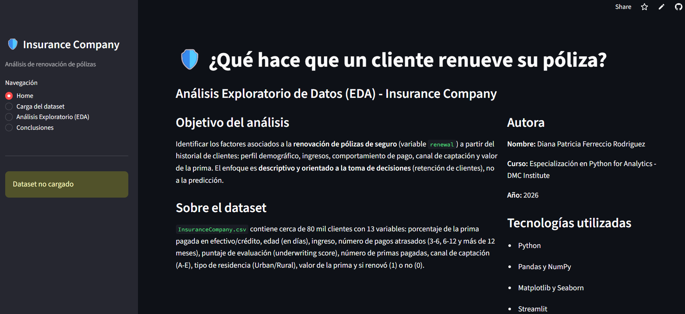
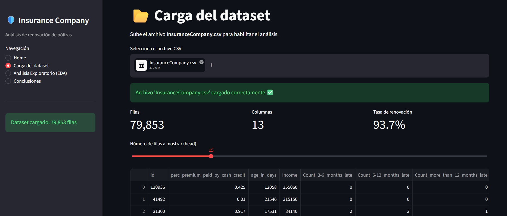
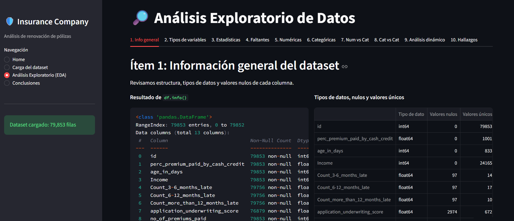
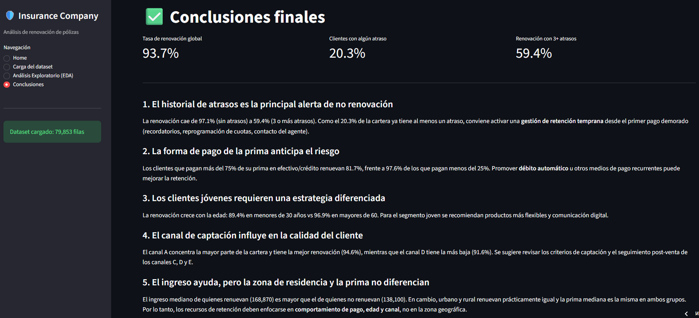

# ¿Qué hace que un cliente renueve su póliza? - EDA Insurance Company

Aplicación interactiva en **Streamlit** para el Análisis Exploratorio de Datos (EDA) del dataset `InsuranceCompany.csv`. Busca identificar qué factores están asociados a la **renovación de pólizas de seguro** (variable `renewal`), con un enfoque en la **toma de decisiones de retención**, no en la predicción.

**Autora:** Diana Patricia Ferreccio Rodriguez
**Programa:** Especialización en Python for Analytics, DMC Institute (2026)
**Caso de Estudio N°3:** Trabajo Final

---

## Links

- **App desplegada:** https://trabajo-final-python-insurance.streamlit.app/
- **Repositorio:** https://github.com/di4n420/TrabajoFinal

---

## Contenido de la aplicación

| Módulo | Qué contiene |
|---|---|
| **Home** | Objetivo, autora, descripción del dataset y tecnologías |
| **Carga del dataset** | `st.file_uploader`, validación de columnas, vista previa (`head`) y dimensiones |
| **Análisis Exploratorio (EDA)** | 10 ítems de análisis organizados en tabs |
| **Conclusiones** | 5 conclusiones orientadas a decisiones de negocio |

**Ítems del EDA:**
1. Información general (`.info()`, tipos de datos, nulos)
2. Clasificación de variables (función personalizada `clasificar_variables`)
3. Estadísticas descriptivas (media, mediana, moda, coeficiente de variación)
4. Valores faltantes
5. Distribución de variables numéricas (histogramas)
6. Variables categóricas (conteos, proporciones, barras)
7. Bivariado numérico vs categórico (boxplots y comparación de grupos)
8. Bivariado categórico vs categórico (tablas cruzadas, barras apiladas)
9. Análisis dinámico con filtros (canal, residencia, edad, atrasos)
10. Hallazgos clave (gráfico resumen 2x2)

## Hallazgos principales

- El **93.7%** de los clientes renueva.
- Los **pagos atrasados** son la señal más fuerte: sin atrasos renueva el 97.1%; con 3 o más, solo el 59.4%.
- A mayor **% de la prima pagado en efectivo/crédito**, menor renovación (97.6% vs 81.7%).
- La renovación **aumenta con la edad** (89.4% en menores de 30 años vs 96.9% en mayores de 60).
- El **canal A** tiene la mejor renovación (94.6%) y el **canal D** la peor (91.6%).
- Las zonas **urbana y rural** renuevan prácticamente igual.

## Estructura del proyecto

```
├── app.py                      # Aplicación Streamlit (módulos y widgets)
├── libreria_clases_tf.py       # Clase DataAnalyzer (POO): estadísticas, clasificación y gráficos
├── libreria_funciones_tf.py    # Funciones personalizadas (clasificación, variables derivadas, formatos)
├── InsuranceCompany.csv        # Dataset
├── requirements.txt            # Librerías necesarias
├── capturas/                   # Capturas de la app
└── README.md
```

## Tecnologías

Python · Pandas · NumPy · Matplotlib · Seaborn · Streamlit · Programación Orientada a Objetos

## Cómo ejecutar localmente

1. Clonar el repositorio y entrar a la carpeta.
2. Instalar las dependencias:
   ```bash
   pip install -r requirements.txt
   ```
3. Ejecutar la app:
   ```bash
   streamlit run app.py
   ```
4. En el menú lateral, ir a **Carga del dataset** y subir `InsuranceCompany.csv`.

## Capturas





